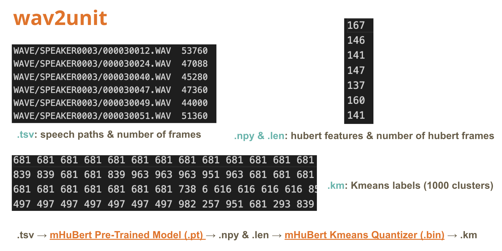

# llama-omni-eng-pa
A CKIP Lab project on applying [Llama-Omni](https://github.com/ictnlp/LLaMA-Omni) for english pronunciation assessment. This repository adapts the training code of Llama-Omni reproduced by [wntg](https://github.com/wntg/LLaMA-Omni).

## Create Conda Environment
1. Clone the repository.
   ```
   git clone https://github.com/ictnlp/LLaMA-Omni
   cd LLaMA-Omni
   ```
2. Install packages.
   ```
   conda create -n llama-omni python=3.10
   conda activate llama-omni
   pip install pip==24.0
   pip install -e .
   ```
3. Install `fairseq`.
   ```
   git clone https://github.com/pytorch/fairseq
   cd fairseq
   pip install -e . --no-build-isolation
   ```
4. Install `flash-attention` (v2).
   ```
   pip install flash-attn --no-build-isolation
   ```
   If the installation fails, please visit [here](https://github.com/Dao-AILab/flash-attention/releases) to download the wheel files, and then rerun the above command.

## Installation
1. Clone this repository.
   ```
   git https://github.com/chiawen0104/llama-omni-ckip_pa
   cd llama-omni-ckip_pa
   ```
2. Download the `Llama-3.1-8B-Omni` model from [Huggingface](https://huggingface.co/ICTNLP/Llama-3.1-8B-Omni).
   ```
   pip install huggingface_hub
   huggingface-cli login
   ```
   ```
   huggingface-cli download ICTNLP/Llama-3.1-8B-Omni --local-dir ./Llama-3.1-8B-Omni
   ```
3. Download the `Whisper-large-v3` model.
   ```
   import whisper
   model = whisper.load_model("large-v3", download_root="models/speech_encoder/")
   ```
4. Download the unit-based HiFi-GAN vocoder.
   ```
   wget https://dl.fbaipublicfiles.com/fairseq/speech_to_speech/vocoder/code_hifigan/mhubert_vp_en_es_fr_it3_400k_layer11_km1000_lj/g_00500000 -P vocoder/
   wget https://dl.fbaipublicfiles.com/fairseq/speech_to_speech/vocoder/code_hifigan/mhubert_vp_en_es_fr_it3_400k_layer11_km1000_lj/config.json -P vocoder/
   ```
5. Download the `HuBERT` model and quantizer from [fairseq](https://github.com/facebookresearch/fairseq/blob/ust/examples/speech_to_speech/docs/textless_s2st_real_data.md#hubert).
   ```
   wget https://dl.fbaipublicfiles.com/hubert/mhubert_base_vp_en_es_fr_it3.pt -P models/wav2unit
   wget https://dl.fbaipublicfiles.com/hubert/mhubert_base_vp_en_es_fr_it3_L11_km1000.bin -P models/wav2unit
   ```
6. Download wav files from [speechocean762](https://github.com/jimbozhang/speechocean762) and put them in `speechocean/WAVE`.

## Usage
### Train
#### Stage1    
```
bash omni_speech/train/run_stage1.sh
```
#### Stage2
```
bash omni_speech/train/run_stage2.sh
```

### Inference
#### Stage1
```
bash omni_speech/infer/run_infer1.sh speechocean/
```
#### Stage2
```
bash omni_speech/infer/run_infer2.sh speechocean/
```

### unit2wav
```
bash omni_speech/infer/unit2wav.sh
```
The result files are in `/speechocean/speech_units`.

### wav2unit (prepare training data for stage2)
Steps:  

#### Step1: Generate .tsv
```
python speechocean/generate_tsv.py
```
Current tsv files are in `/speechocean`.
#### Step2: Generate .npy & .len
```
bash run_dump_hubert_feature.sh
```
#### Step3: Generate .km
```
bash run_dump_km_label.sh
```
#### Step4: Prepare data for stage2
```
python speechocean/prepare_data_s2.py
```

### PCC Evaluation on Stage 1 Predictions
```
python speechocean/eval_pcc.py
```

## Dataset: speechocean762
### Data Split
I split 500 samples from the original training set to serve as the validation set, while keeping the testing set unchanged.
|  | original | this repo |
|------|------|------|
| train | 2500 | 2000 |
| valid | x | 500 |
| test | 2500 | 2500 |

`train.josn`, `valid.json`, and `test.josn` are in `speechocean/`. You can view score label distribution from images in `speechocean/images`.

### Stage2 Data
Files are in `speechocean/stage2_data`.

### Dataset Links
1. [Git hub](https://github.com/jimbozhang/speechocean762)
2. [Huggingface](https://huggingface.co/datasets/mispeech/speechocean762)


## Use other Llama Models
You can replace `Llama-Omni` with other Llama models as base model such as [Llama-3.1-8B-Instruct](https://huggingface.co/meta-llama/Llama-3.1-8B-Instruct) and [Llama-3.2-1B-Instruct](https://huggingface.co/meta-llama/Llama-3.2-1B-Instruct) for fine-tuning. You should download models from huggingface and adpat `config.json`, please refer files in `configs/`.


## Predictions Directory Structure
Note: 檔名有幾e代表是被訓練過幾個epoch的模型的輸出
```text
predictions/
├── stage1/                         # 第一階段模型預測結果
│   ├── 1shot/                      # Prompt 加上分數輸出範例的無微調模型推論結果
│   ├── asr/                        # ASR 任務推論結果
│   ├── asr_2shots/                 # ASR two-shot prompt
│   ├── asr_pa_2shots/              # Pronunciation Assessment + ASR two-shot prompt 
│   ├── feedback/                   # 讓模型提供文字 feedback
│   ├── pa/                         # PA (Pronunciation Assessment)，輸出預測分數
│   ├── 8b-omni-10e-accu.json       # 訓練 Llama-Omni 做 PA，以 accuracy 分數作為存取檢查點的指標
│   └── 8b-omni-10e-avg.json        # 訓練 Llama-Omni 做 PA，以 avg 分數 (accu, fluency, prosodic, and total) 作為存取檢查點的指標
│
└── stage2/                         # 第二階段模型預測結果
    ├── omni-10e/                   # 將原本 Omni 模型直接進行階段二訓練 10 epochs 的輸出
    ├── omni-10e-accu/              # 將階段一的 8b-omni-10e-accu 進行階段二訓練 10 epochs 的輸出
    ├── target_only/                # 給 Llama-Omni 一段發音與目標分數，叫它生出對應目標分數的語音 (未訓練)
    ├── target_refer_random/        # 給 Llama-Omni 一段發音與目標分數、隨機產生的錯誤分數，叫它生出對應目標分數的語音 (未訓練)
    └── target_refer_score/         # 給 Llama-Omni 一段發音與一組固定參考分數與不同目標分數，叫它生出對應目標分數的語音 (未訓練)，測試是否能針對每個指標的分數做出變化
```
第一階段是`8b-omni-10e-accu`可取得最好PCC結果，第二階段尚未測試出成功生成符合分數的語音。
